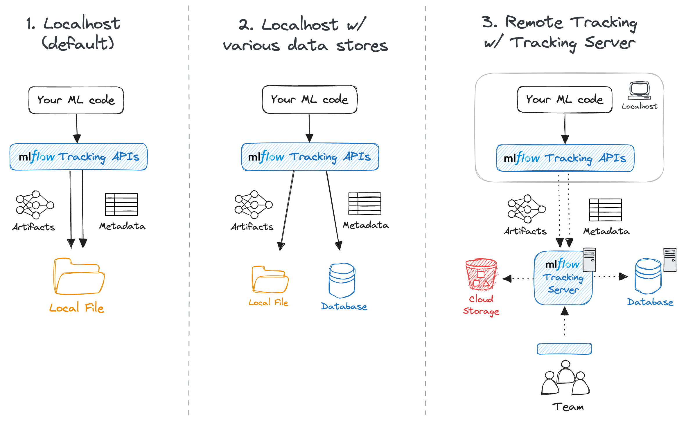

# MLflow Basic - Fraud Detection on YelpChi

MLflow-tracked ML experimentation for fraud detection on the [YelpChi](https://github.com/YingtongDou/CARE-GNN) dataset. Compares classical and deep learning models on a graph-structured dataset (~45k nodes, 32 features, binary fraud labels). This example was taken from the book [Graph Neural Network in Action](https://www.manning.com/books/graph-neural-networks-in-action) and modified.

## Setup

**Requirements:** Python 3.12, [uv](https://github.com/astral-sh/uv)

```bash
uv sync
```

**Setting up MLflow for tracking**

There are three different options to run MLflow for tracking, as shown on the figure below



**Option 1 - Localhost (default):** Artifacts and metadata are stored on the local filesystem under `mlruns/`. No server is needed. Set the tracking URI to a local path:

```bash
# .env
MLFLOW_TRACKING_URI=./mlruns
```

View results with:

```bash
uv run mlflow ui
```

**Option 2 - Localhost with various data stores:** Run a local MLflow tracking server backed by a database for metadata and a configurable artifact store. Start the server before running any script.

*Option 2a - SQLite (simple, no extra setup):*

```bash
uv run mlflow server \
  --backend-store-uri sqlite:///mlflow.db \
  --default-artifact-root ./mlartifacts \
  --host 0.0.0.0 --port 5000
```

*Option 2b - PostgreSQL via Docker (recommended):*

A `docker-compose.yml` is provided in `docker/` that starts a PostgreSQL database and an MLflow tracking server together:

```bash
docker compose -f docker/docker-compose.yml up -d
```

This exposes the MLflow UI at `http://localhost:5000`. Metadata is persisted in a named Postgres volume and artifacts in a named `mlartifacts` volume. To stop and remove containers (data volumes are preserved):

```bash
docker compose -f docker/docker-compose.yml down
```

For both Option 2a and 2b, set:

```bash
# .env
MLFLOW_TRACKING_URI=http://localhost:5000/
```

**Option 3 - Remote tracking server:** Deploy MLflow on a shared host so the whole team can log and compare runs. Metadata is stored in Postgres and artifacts in cloud storage (e.g. S3 or an S3-compatible store such as MinIO).

On the **remote host**, clone this repo and start the stack using `docker/docker-compose.remote.yml`. The compose file reads configuration from environment variables - create a `.env` file next to it (never commit this):

```bash
# On the remote host
POSTGRES_PASSWORD=<strong-password>
AWS_ACCESS_KEY_ID=<key>
AWS_SECRET_ACCESS_KEY=<secret>
ARTIFACT_ROOT=s3://<your-bucket>/mlflow   # or gs://<bucket>/mlflow for GCS

# Optional: only needed for S3-compatible stores (e.g. MinIO)
# MLFLOW_S3_ENDPOINT_URL=http://<minio-host>:9000
```

```bash
docker compose -f docker/docker-compose.remote.yml up -d
```

The MLflow UI will be available at `http://<remote-host>:5000`. Expose it behind a reverse proxy (e.g. nginx, Caddy) with TLS for production use.

On your **local machine**, point the client at the remote server:

```bash
# .env
MLFLOW_TRACKING_URI=http://<remote-host>:5000/
```

**Configure MLflow environment variables:**

```bash
cp .env.example .env
# Edit .env with your MLflow tracking URI and experiment name
```

`.env` variables:

| Variable | Description | Default |
|---|---|---|
| `MLFLOW_TRACKING_URI` | MLflow server URL | `http://localhost:5000/` |
| `EXPERIMENT_NAME` | MLflow experiment name | `yelp_review` |

**Dataset:** Unzip `YelpChi.zip` in `data/`. The adjacency list pickle is generated automatically on first run.

## MLflow tracking basics

### MLflow tracking

Each script calls `mlflow.set_experiment()` to group runs under the experiment named by `EXPERIMENT_NAME`, then wraps training in `mlflow.start_run()`. Within each run:

- `mlflow.log_params()` - records hyperparameters once at the start of the run:

| Script | Logged parameters |
|---|---|
| `logres.py` | `random_state`, `threshold` |
| `xgb.py` | `n_estimators`, `max_depth`, `learning_rate`, `subsample`, `colsample_bytree`, `threshold` |
| `mlp.py` | `epochs`, `patience`, `lr`, `threshold`, `hidden_sizes` |
| `gcn.py` | `epochs`, `patience`, `lr`, `threshold`, `hidden_sizes` |
| `gat.py` | `epochs`, `patience`, `batch_size`, `lr`, `threshold`, `hidden_sizes`, `heads` |

- `mlflow.log_metrics()` - records evaluation metrics. Classical models (`logres`, `xgb`) log once after training; deep learning models (`mlp`, `gcn`, `gat`) log per epoch with a step index, producing time-series curves in the UI:

| Script | Logged metrics |
|---|---|
| `logres.py`, `xgb.py` | `roc_auc`, `f1`, `precision`, `recall` |
| `mlp.py`, `gcn.py`, `gat.py` | `train_loss`, `val_loss`, `roc_auc`, `f1`, `precision`, `recall` (per epoch) |

**Note:** MLflow also has autolog capabilities for most default ML libraries which will automatically log parameters, metrics and model. Instead of using `mlflow.log_params()` and `mlflow.log_metrics()` only use `mlflow.autolog()` before the training loop. For PyTorch, only PyTorch Lightning modules can be autologged.

### MLflow models

TODO

### MLflow dataset

TODO

## Running Models

All scripts must be run from the repo root so `data/` paths resolve correctly.

```bash
# Logistic Regression
uv run python src/logres.py

# XGBoost
uv run python src/xgb.py

# MLP (PyTorch)
uv run python src/mlp.py
uv run python src/mlp.py --epochs 1000 --patience 50 --hidden-sizes 64 32 --lr 0.001

# GCN (PyTorch Geometric)
uv run python src/gcn.py
uv run python src/gcn.py --epochs 1000 --patience 50 --hidden-sizes 64 32

# GAT (PyTorch Geometric)
uv run python src/gat.py
uv run python src/gat.py --epochs 1000 --patience 50 --hidden-sizes 64 32 --heads 4
```

All scripts accept `--matrix` and `--adjlist` to override default data paths.

### Logistic Regression options

| Flag | Default | Description |
|---|---|---|
| `--thres` | 0.5 | Classification threshold |
| `--random-state` | 0 | Random seed |

### XGBoost options

| Flag | Default | Description |
|---|---|---|
| `--n-estimators` | 100 | Number of boosting rounds |
| `--max-depth` | 6 | Maximum tree depth |
| `--lr` | 0.3 | Boosting learning rate (eta) |
| `--subsample` | 1.0 | Subsample ratio of training instances |
| `--colsample-bytree` | 1.0 | Subsample ratio of columns per tree |
| `--thres` | 0.5 | Classification threshold |

### MLP options

| Flag | Default | Description |
|---|---|---|
| `--epochs` | 10000 | Maximum training epochs |
| `--patience` | 100 | Early stopping patience |
| `--hidden-sizes` | 64 | Hidden layer sizes, e.g. `--hidden-sizes 64 32` |
| `--lr` | 0.001 | Learning rate |
| `--thres` | 0.5 | Classification threshold |

### GCN options

| Flag | Default | Description |
|---|---|---|
| `--epochs` | 10000 | Maximum training epochs |
| `--patience` | 100 | Early stopping patience |
| `--hidden-sizes` | 64 | Hidden layer sizes, e.g. `--hidden-sizes 64 32` |
| `--lr` | 0.001 | Learning rate |
| `--thres` | 0.5 | Classification threshold |

### GAT options

| Flag | Default | Description |
|---|---|---|
| `--epochs` | 10000 | Maximum training epochs |
| `--patience` | 100 | Early stopping patience |
| `--batch-size` | 256 | Batch size for neighbour sampling |
| `--hidden-sizes` | 32 | Hidden layer sizes, e.g. `--hidden-sizes 64 32` |
| `--heads` | 1 | Number of attention heads per GAT layer |
| `--lr` | 0.001 | Learning rate |
| `--thres` | 0.5 | Classification threshold |

## Models

| Script | Model | Framework |
|---|---|---|
| `src/logres.py` | Logistic Regression | scikit-learn |
| `src/xgb.py` | XGBoost | xgboost |
| `src/mlp.py` | MLP with configurable hidden layers and early stopping | PyTorch |
| `src/gcn.py` | Graph Convolutional Network with configurable hidden layers | PyTorch Geometric |
| `src/gat.py` | Graph Attention Network with configurable hidden layers and attention heads | PyTorch Geometric |

## Metrics

All models report: **ROC AUC**, **F1-score**, **Precision**, **Recall** (threshold 0.5 for binary predictions). Metrics are logged to MLflow for each run.

## Development

```bash
# Lint and format
uv run ruff check src/
uv run ruff format src/
```
